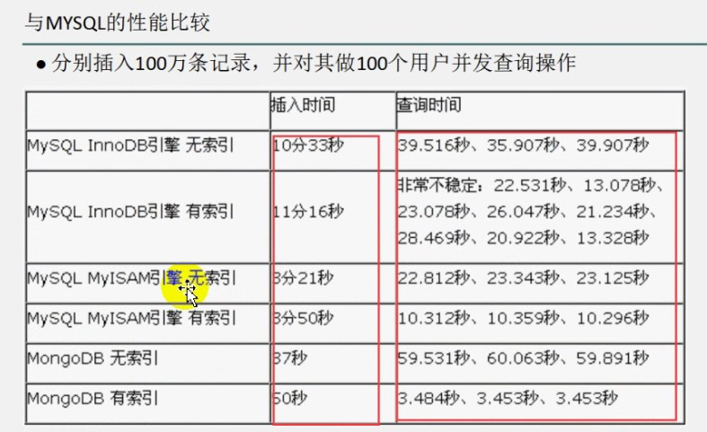
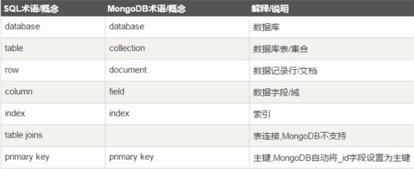
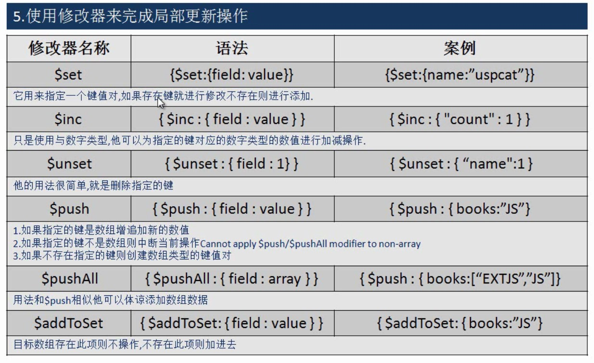
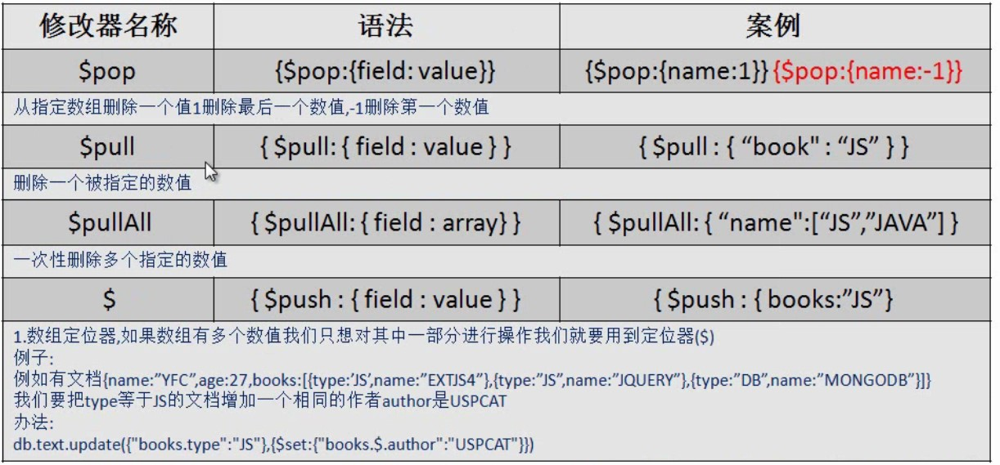
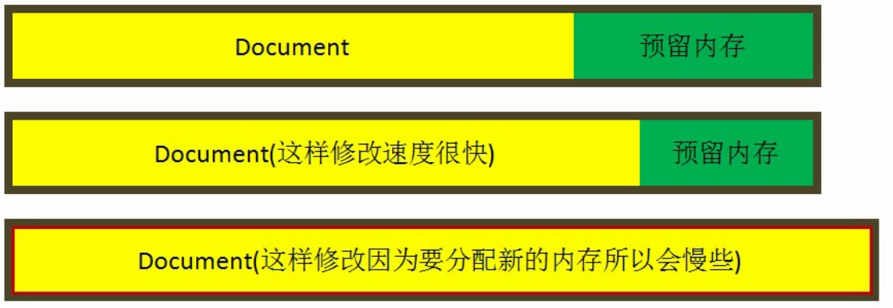

# MongoDB

## NoSQL

> Not Only SQL 非关系型数据库, 内存级读写（毫秒级）

### NoSQL 分类

- 列存储：Hbase, Cassndra, Hypertable
- 文档存储：MongoDB, CouchDB
- key-value存储：Tokyo Cabinet /Tyrant, Berkeley DB, MemcacheDB
- 图存储：Neo4J, FlockDB
- 对象存储：db4o, Versant
- xml数据库：Berkeley DB XML, BaseX

### 为什么出现 NoSQL

> 随着访问量的上升，网站的数据库性能出现问题

- Redis
  - key-value
  - 登录 list 双向链表
  - set 集合合并（好友，朋友圈，共同的好友[交集]）
- memcache
  - key-value 缓存服务

### NoSQL 特点

2010年左右，中国互联网、物联网兴起，新型创业公司的最爱，新的公司可以基于新的架构开发新的产品，可以尝试新的东西和新的技术。大数据、高并发、网络服务类型公司

### 数据存储量大

- mysql 1000万以内，数据库性能可以，上亿条则数据库性能有降低，进行mysqly优化，当然和服务器性能有关系
- oracle：几亿-几十亿，数据库性能有保障，商业付费高
- mongodb: 单标存储的数据可以是 PB 级

B -> KB -> M -> G -> T -> PB -> EB -> ZB

## Introduction MongoDB

### What [MongoDB](https://mongodb.com)

> 分布式文档存储的NoSQL数据库

- C++语言编写，运行稳定、性能高
- Web 应用提供可扩展的高性能数据存储解决方案

## MongoDB Features

- 模式自由：不同结构的文档存储在同一个数据库里
- 面向集合的存储：适合存储 JSON 风格文件的形式
- 完整的索引支持：对任何属性可索引
- 复制和高可用性：支持主从撇脂
- 自动分片
- 丰富的查询
- 快速的更新
- 高效的传统存储方式：支持二进制数据及大型对象（图片等）

### 优点

- 高可扩展性
- 分布式计算
- 低成本
- 架构的灵活性，半结构化数据
- 没有复杂的关系

### 缺点

- 没有标准化
- 有限查询功能

### 查询数据速度



### 结构特点

MySQL 需要前期设计数据库 库->表->字段。多个表的设计，关联操作（连表查询，union, left, right）每个字段都有一个类型（char, varchar, int, date...）

- mysql: 数据库，数据表，记录
- mongodb: 数据库，集合，文档



- 解释/SQL/MongoDB
- 数据库/database/database
- 表, 集合/table/collection
- 记录,文档/row/document
- 字段, 域或键/column/field/key
- 索引/index/index
- 表连接/join/无
- 主键/primary key/primary key

- 三元素：数据库/集合/文档
  - 集合就是关系数据库中的表，存储多个文档
  - 文档对应着关系数据库中的行
  - 文档，就是一个对象，有键值对构成，是json的扩展BSON形式

### 适合存储的信息

**大数据量的信息，丢失率相对就高**，就存储一些相对于不太重要的信息

**银行的余额信息**，事务（回滚）

微博的评论，淘宝的评论，网站流量的统计

### 各公司使用的NoSQL

- 新浪微博：**Redis**
- Google: **Bigtable**
- Amazon: **SimpleDB**
- 淘宝数据平台：**Tair**
- 优酷视频：**MongoDB**
- 飞信空间：**HandleSocket**
- 视觉中国网站：**MongoDB**

### 用户浏览过程

- user -> application ->redis/mongodb -> mysql

## 下载安装 MongoDB

### Linux 先安装

- 开启验证模式: `# mongod -f /etc/mongod.conf --fork --auth`

### Windows 下安装

**注意**：安装之前建立一个目录用于存储**mongodb的数据**

1. 启动服务（指定数据安装目录）`E:\usr_local\mongodb\bin\mongod.exe --dbpath E:\usr_local\mongodb\data`
2. 配置环境变量 path: `E:\usr_local\mongodb\bin`
3. 启动数据库服务：修改 **mongodb.bat** 文件

- 27017端口(原生端口) shell/GUI
- 28017端口(扩展端口) 用于web服务

- 服务器端：**mongod.exe**
- 客户端：**mongo.exe**

#### 启动mongodb服务

- 使用管理员权限模式 cmd
- 创建数据库存放目录，及其日志存放地址

```bat
mongod --dbpath E:\usr_local\mongodb\data --logpath E:\usr_local\mongodb\logo.txt --install
```

#### 客户端连接mongodb服务

**mongo.bat**

```bat
mongo 127.0.0.1:27017
```

#### 卸载mongodb服务

1. 先关闭服务
2. 卸载操作

**mongodb-remove.bat**

```bat
mongod --dbpath E:\usr_local\mongodb\data --logpath E:\usr_local\mongodb\logo.txt --remove
```

## mongodb操作

MongoDB无状态模式，不用去设计，直接用，存什么东西，取决于前边传后边存什么

- 切图仔 -> 大前端(懂后端)-> 全栈工程师

### 数据库操作

- 创建数据库：`use [databaseName]` （什么都不操作就离开时这个空数据库就会被删除）
- 查看数据库：`show dbs`
  - 显示 **admin/config/local** 三个数据库
- 获取数据库名：`db.getName()`
- 查看数据库状态: `db.stats()`
- 删除数据库：`db.dropDatabase()`
- 切换数据库：`use [databaseName]`

### 集合操作

- 给指定数据库添加集合并且添加记录：`db.persons.insert({name: "wovert"})`
  - 集合：`persons`
  - 文档：`{name:wovert}`
- 查看当前数据库中的所有文档: `show collections`
- 删除库中的集合: `db.persons.drop()`

```bson
db.createCollection(name, options)
db.createCollection("stu", {capped:true, size:10})
capped 覆盖
```

### 文档操作

- 查询指定文档的所有数据：`db.[documentName].find()`
- 查询第一条数据：`db.[documentName].findOne()`
- 删除文档数据：`db.[documentName].remove({删除条件})`
- 更新文档数据: `db.[documentName].update({查询条件}, {$set: {更新内容}})`
  - `db.[documentName].update({name:'hr',{$set:{name:'hys'}}})` $set 不修改文档结构
  - `db.[documentName].update({name:'hr',{$set:{name:'hys'}}}, {multi:true})` 修改多行，默认修改一行
- 删除
  - `db.[documentName].remove({条件}, {justOne:false})` 默认删除所有
  - `db.[documentName].remove({})` 全部删除

```bson
db.persons.update({name:'wovert'}, {$set: {name: 'wovert.com'}})
var p = db.persons.findOne()
db.persons.update(p, {name: "mew value"})
```

### 创建用户

```bson
use admin
db.createUser({
  user:'admin',
  pwd:'adminpwd',
  roles:[{role:'userAdminAnyDatabase', db:'admin'}]
})
db.auth('admin','adminpwd')

use test
db.createUser({
  user:'test',
  pwd:'testpwd',
  roles:[{role:'readWrite',db:'test'}]
})
db.auth('test','testpwd')
```

### 修改密码

db.changeUserPassword('username','password');  

### 帮助操作

- 帮助命令：`db.help()`
- 集合帮助：`db.persons.help()`

### 数据库和集合命令规范

1. 不能是空字符串
2. 不得含有 ' '(空格)、,(逗号)、$、/、\和\O(空字符)
3. 应全部小写
4. 最多64个字节
5. 数据库名不能与现有系统保留库同名，如admin, local 及config

- 数据库名：`ab-cd`
  - `use db-cd`
  - `db.getCollection("ad-cd").text.insert({}})`

### mongoDB的shell内置js引擎可以直接执行js代码

```bson
function insert(object) {
  db.getCollection("db-text").insert(object)
}
insert({age:32})
```

**shell** 可以用 `eval`

`db.eval("return 'wovert'")`

### 插入文档

```bson
db.persons.insert({_id:"001", name:"abc"})
```

#### 批量插入文档

- shell不支持批量插入
- 使用mongo的应用驱动或是shell的for循环批量插入文档

```bson
for(var i=0; i<10; i++) {
... db.persons.insert({name:i})
... }
```

#### save操作

- `save`操作和`insert`操作区别在于当遇到`_id`相同的情况下
  - `save`完成保存操作
  - `insert`则会报错

#### 删除列表中的所有数据

`db.[documentName].remove()` 集合的本身和索引不会被删除

#### 根据条件删除

`db.[documentName].remove([{name:"abc"}])`

小技巧：直接删除大数据量集合比使用remove效率高很多

#### 强硬的文档替换式更新操作

`db.[documentName].update({查询器}, {修改器})`

强硬的更新会用新的文档代替老的文档

#### 主键冲突的时候报错并且停止更新操作

因为强硬替换当替换的文档和已有文档ID冲突的时候则系统会报错

#### insertOrUpdate 操作

- 目的：查询器查出来数据就执行更新操作，查不出来就替换操作
- 做法：`db.[documentName].update({查询器}, {修改器}, true)`

#### 批量更新操作

默认情况下当查询器查询出多条数据的时候默认就修改第一条数据

如何实现批量修改：`db.persons.update({name:"33"}, {$set: {name:"333"}}, false, true)`





#### $addToSet与$each结合完成批量数组更新

`db.text.update({_id: 1000}, {$addToSet: {books: {$each: ["js", "DB"]}})`

$each会循环后面的数据班每一个数值进行$addToSet操作

#### 存在分配与查询效率

当docment被创建的是时候DB为其分配没存和预留内存当修改操作不超过预留内层的时候则速度非常快反而超过了就反要分配新的内存则会消耗时间



## BSON是JSOn的扩展

> 新增了如日期、浮点等JSOn不支持的数据类型

- null: 用于表示空或者不存在的字段
- 布尔：true|false
- 32/64 bit intege：shell中不支持需用到其他高级语言的驱动来完成，JS不可使用
- 64bit float: shell中使用的数字其他全是这种类型 {x: 3.14}
- UTF-8: 字符串类型
- 对象ID: 内置默认ID对象{_id: ObjectId()}
- 日期：{x: new Date()}
- 正则：{x:/wovert/i}
- JavaScript代码块: {x: function(){...}}
- undefined: 为定义类型注意它和null不是一个类型
- 数组：{gps: [20, 23]}
- 内嵌文档：{x: {name: "wovert"}}
- 二进制：任意字节的字符串shell中时无法使用的

## MongoDB GUI

- [Robo](https://robomongo.org)

## 数据类型

- Object ID：文档ID (12byte 16机制)
  - 4 byte timestamp
  - 3 byte 机器id
  - 2 byte mongodb的服务进程id
  - 3 byte 增量值
- String
- Boolean
- Integer
- Double
- Arrays
- Object
- Null
- Timestamp
- Date

## 条件查询

### 比较运算符

- 等于 `db.stu.find({name:'gj'})`
- `$lt`
- `$lte`
- `$gt`
- `$gte` db.stu.find({age:{$gte:18}})`
- `$ne`
- `$o`r (大于): `db.stu.find({$or:[{age:{$gt:18}},{gender:1}]})`

### 范围运算符

- `$in, $nin`
- `db.stu.find({age:{$in:[18,28]}})`

### 正则表达式

- // or $regex
- `db.stu.find({name:/^ad/})`
- `db.tu.find({name:{$regex:'^ad'}})`

### 自定义查询

`db.stu.find({$where: function(){return this.age>20}})`

### limit

`db.stu.find().limit(2)`

### skip 跳过指定数量

`db.stu.find().skip(2) 第三条开始`

### 投影

`db.stu.find({}, {_id:0,字段名:1,...})`

- 1:显示，0:不显示

### 排序

- 1:升序
- -1:降序

`db.stu.find().sort({字段:1})`

### 统计个数

- `db.stu.find(条件).count()`
- `db.stu.count({条件})`

### 消除重复

`db.stu.distinct(去重字段, {条件})`

### 聚合 aggregate

`db.stu.aggregate([{管道:{表达式}}])`

- 管道

`$group`  集合中的文档分组

- 按gender分组，counter作为计算男生，女生的总人数

```bson
db.stu.aggregate([{
	$group: {
		_id: '$gender',
		counter: {$sum:1} 或者 {$sum:'$age'}, {$push:'$$ROOT'}
	}
}])
```

**$match: 过滤数据**

```bson
age > 20
db.stu.aggregate([
	{$match:{age:{$gt:20}}}
])
```

**$project**: 投影；结果集中一部分显示
	
```bson
db.stu.aggregate([
	{
		$group:
			{
				_id: '$gender',
				counter: {$sum:1} 或者 {$sum:'$age'}, {$push:'$$ROOT'}
			}
	},
	{
		$project: {
			_id: 0,
			counter: 1
		}
	}
])
```


**$sort**

```bson
db.stu.aggregate([
	{$group:{
				_id: '$gender',
				counter: {$sum:1} 或者 {$sum:'$age'}, {$push:'$$ROOT'}
			}
	},
	{$project: {_id: 0,counter: 1}
	},
	{$sort:{counter:1}}
])
```

$limit

$skip

- $unwind: 将数组类型的字段进行拆分
`db.t2.insert({_id:1, title:'t-shirt', size:['M','L','S']})`

```bson
db.t2.aggregate([
	{$unwind:'$size'}
])
```

- 表达式
  - $sum
  - $avg
  - $min
  - $max
  - $push: 数组
  - $first
  - $last

- $$ROOT: 将文档内容加入到结果集的数组中

explain 性能分析 `db.t1.find().explain('executionStats')`

创建索引 `db.t1.ensureIndex({属性:1[,属性:2]})`

`db.t1.getIndexes()`

`db.t1.dropIndexes('索引名称')`

## 用户管理

> 角色-用户-数据库的安全管理方式

- 系统角色
  - root: 只在admin数据库的可用，超级账号/超级权限
  - Read: 允许用户读取指定数据库
  - readWrite: 允许用户读写指定数据库

### 创建超级管理员

```bson
use admin
db.createUser({
  user:'admin',
  pwd:'123',
  roles:[{role:'root',db:'admin'}]
})
```

- 启用安全认证

```sh
# sudo vi /etc/mongod.conf
ecurity:
  authorization: enabled

# mongo --help
# mongo -u admin -p 123 --authenticationDatabase admin
> db
> use admin
> show collections
> db.syste.users.find()
> show users()
```

- 创建普通用户

```bson
use test
db.createUser({
  user:'test',
  pwd:'123',
  roles:[{role:'readWrite',db:'test'}]
})
```

## 复制(副本集)

1. create directory
`$ mkdir {t1,t2}`

2. start mongod

``` sh
# mongod --help
# mongod --bind_ip 192.168.100.1 --port 12017 --dbpath ~/t1 --replSet rs0
# mongod --bind_ip 192.168.100.1 --port 12017 --dbpath ~/t2 --replSet rs0
```

## 手动备份

- 备份

```sh
# mongodump -u user -p 123 -h host --authenticationDatebase dbname -d dbname -o dbdirectory
```

- 恢复

`$ mongorestore -u admin -p 123 -h host  --authenticationDatebase admin -d dbname --dir dbdirectory`
`--dir: 备份数据所在位置`

## py交互

`# sudo pip install pymongo`
